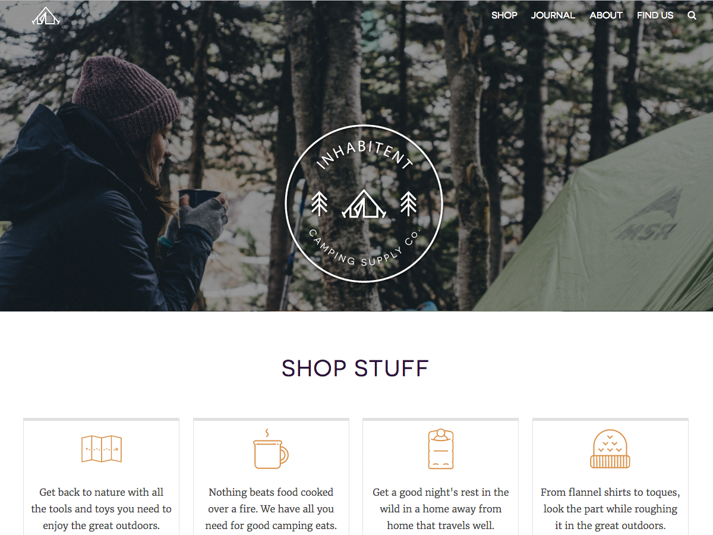

# Inhabitent
This is a multi-page website with a blog for a camping supply company called Inhabitent Camping Supply Co. using WordPress as a content management system.

###Technologies used
- by using the redstarter WordPress theme as a base for building Inhabitent website
- Include a widgetized area in the sidebar
- Include a custom widget plugin to allow business hours to easily be edited in the sidebar by the client
- Include a custom post type for “Products” inside of a functionality plugin (not the theme files)
- Include a custom taxonomy for “Product Type” inside of a functionality plugin (not the theme files)
- Include applicable custom fields for additional metadata where required (using the Custom Field Suite plugin)

###Personal learnings
- The WP template hierarchy 